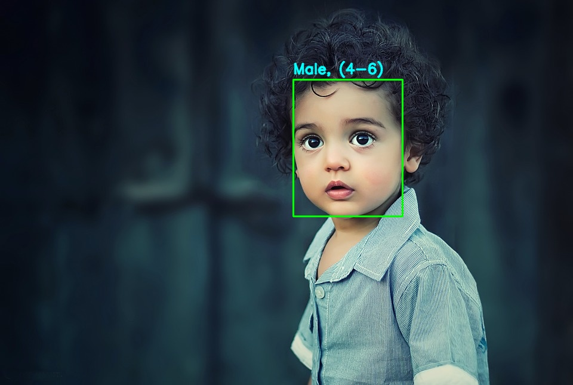

# Age-and-Gender-Detection
### **📝 README.md برای پروژه "تشخیص سن و جنسیت"**  

**📌 توضیحات پروژه**  
این پروژه از **یادگیری عمیق (Deep Learning)** و **بینایی کامپیوتری (Computer Vision)** برای تشخیص **سن و جنسیت افراد از روی تصاویر، ویدیوها و وبکم** استفاده می‌کند. این مدل با استفاده از **OpenCV و شبکه‌های عصبی عمیق (DNNs)** پردازش می‌شود.  

---

## **🚀 ویژگی‌های پروژه**
✔ تشخیص **سن و جنسیت** از تصویر، ویدیو و وبکم  
✔ استفاده از مدل‌های از پیش آموزش‌دیده برای دقت بالاتر  
✔ پردازش در **زمان واقعی (Real-Time)**  
✔ نمایش **FPS** روی فریم‌ها برای مشاهده عملکرد مدل  
✔ قابلیت تست روی **تصاویر، ویدیوهای ذخیره‌شده و وبکم**  

---

## **📌 نحوه اجرا**
### **۱. کلون کردن مخزن**
ابتدا کدهای پروژه را دانلود کن:

```sh
git clone https://github.com/AliShafiee2003/Age-and-Gender-Detection.git
cd Age-and-Gender-Detection
```

---

### **۲. نصب پیش‌نیازها**
ابتدا باید **پکیج‌های موردنیاز** را نصب کنی. می‌توانی از دستور زیر استفاده کنی:

```sh
pip install -r requirements.txt
```

---

### **۳. اجرای برنامه**
#### **📸 اجرای مدل روی تصویر**
برای تست مدل روی یک تصویر، از این دستور استفاده کن:

```sh
python app.py --image images/kid.jpg
```

#### **📹 اجرای مدل روی ویدیو**
اگر می‌خواهی مدل را روی یک ویدیو تست کنی:

```sh
python app.py --video videos/sample.mp4
```

#### **🎥 اجرای مدل روی وبکم**
برای اجرای مدل با وبکم لپ‌تاپ یا دوربین متصل، از این دستور استفاده کن:

```sh
python app.py --webcam
```

---

## **📂 ساختار فایل‌ها**
```
📦 Age-and-Gender-Detection
 ┣ 📂 models
 ┃ ┣ 📄 opencv_face_detector.pbtxt       # تنظیمات مدل تشخیص چهره
 ┃ ┣ 📄 opencv_face_detector_uint8.pb    # مدل تشخیص چهره
 ┃ ┣ 📄 age_deploy.prototxt              # تنظیمات مدل تشخیص سن
 ┃ ┣ 📄 age_net.caffemodel               # مدل شبکه عصبی برای تشخیص سن
 ┃ ┣ 📄 gender_deploy.prototxt           # تنظیمات مدل تشخیص جنسیت
 ┃ ┗ 📄 gender_net.caffemodel            # مدل شبکه عصبی برای تشخیص جنسیت
 ┣ 📂 images
 ┃ ┗ 📄 kid.jpg                          # تصویر نمونه برای تست
 ┣ 📂 videos
 ┃ ┗ 📄 sample.mp4                        # ویدیوی نمونه برای تست
 ┣ 📂 outputs
 ┃ ┗ 📄 result1.jpg                      # خروجی پردازش‌شده
 ┣ 📄 app.py                              # کد اصلی برای پردازش تصویر و ویدیو
 ┣ 📄 requirements.txt                    # لیست پکیج‌های مورد نیاز
 ┗ 📄 README.md                           # توضیحات پروژه
```

---

## **🛠 تکنولوژی‌های استفاده‌شده**
✔ **Python** 🐍  
✔ **OpenCV** 📷 (برای پردازش تصویر)  
✔ **DNN Models** 🧠 (شبکه‌های عصبی برای تشخیص چهره، سن و جنسیت)  
✔ **Matplotlib** 📊 (برای نمایش نتایج)  
✔ **Numpy** 🔢 (برای پردازش داده‌ها)  

---

## **📸 نمونه خروجی**
**🔹 تصویر نمونه پردازش شده:**


---

## **📜 لایسنس**
این پروژه تحت لایسنس **MIT** منتشر شده است و استفاده از آن **کاملاً آزاد** است.

---

## **🤝 توسعه‌دهنده**
👨‍💻 توسعه داده شده توسط **[AliShafiee2003](https://github.com/AliShafiee2003)** 🚀  

📬 اگر سؤالی داشتی، از طریق **Issues** در مخزن GitHub بپرس یا در **Pull Requests** مشارکت کن!  

---
